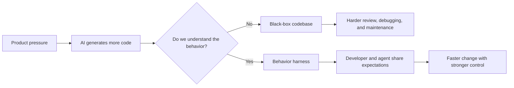
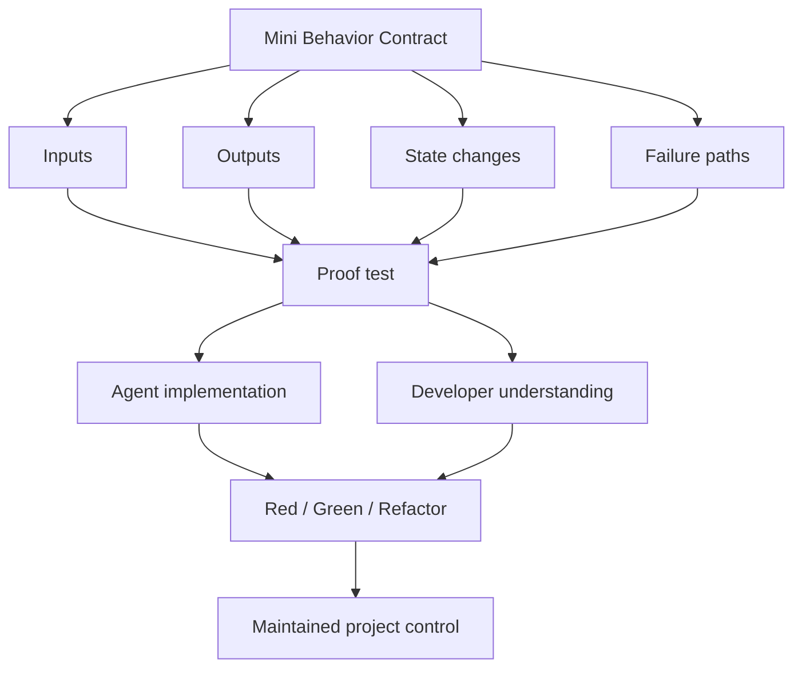
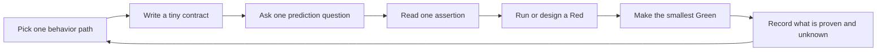

# Interactive TDD Pedagogy Skills

A skill package for AI pair programming when the goal is not merely to make the
agent write more code, but to help the developer regain control over what the
code actually does.

Modern models can produce hundreds or thousands of lines of code quickly. At the
same time, product requirements keep changing, systems keep growing, and the old
way of slowly hand-writing every line no longer matches the speed of AI-assisted
development. The risk is that the codebase becomes a black box: the agent writes
more, the developer understands less, and long-term ownership gets weaker.

`interactive-tdd-pedagogy` is built for the opposite direction. It uses AI pair
programming to improve your ability to read, question, test, and take over code,
especially when the project is unfamiliar, the language is unfamiliar, or the
business behavior is unclear. The skill turns code takeover into a sequence of
small behavior contracts, assertion-first reading, Socratic checkpoints, and
contract-gated red-green-refactor loops.

## Core View

The essence of TDD is not that tests magically make code better. The essence is
that tests force us to understand behavior: inputs, outputs, state changes,
failure paths, and the expectations that the system must preserve. Only when we
understand code behavior can we write, review, maintain, and change the code
responsibly.

As AI becomes better at generating code, our responsibility does not disappear.
It becomes more important. LLMs are still probabilistic systems. They can help
us move faster, but they cannot be the final owner of the project. The developer
still has to know what behavior is expected, what has been proven, what remains
uncertain, and how future changes can be made without losing control.

This is where a harness matters. A harness aligns the agent with expected
behavior, but it also aligns the developer with that same expectation. The point
is not only "make the agent pass tests." The point is to create a shared,
executable understanding of the system so that AI-assisted development increases
project control instead of turning the project into an opaque dependency on the
agent.

## What This Skill Helps With

- Quickly taking over an unfamiliar codebase through narrow behavior paths.
- Reading tests backward from assertions to the business behavior they prove.
- Learning a new language or framework while staying anchored to real project
  behavior instead of abstract syntax trivia.
- Using AI as a pair-programming coach that asks small questions instead of
  dumping large explanations.
- Building and maintaining a test harness that captures human expectations, not
  just agent output.
- Preventing AI-generated code from weakening your own code-reading ability and
  project ownership.

## Visual Model

AI can increase delivery speed while quietly reducing ownership if the developer
does not keep a live model of behavior.



The harness is not only for the agent. It is where the developer, the tests,
and the agent meet around the same expectation.



The learning loop is intentionally small. The point is to build real reading
ability, not to outsource the entire understanding process to the model.



## Install

Install from GitHub with the skills installer:

```bash
npx skills@latest add laid-backprogrammer/interactive-tdd-pedagogy-skills
```

You can also skip the interactive agent picker and target agents directly:

```bash
npx skills@latest add laid-backprogrammer/interactive-tdd-pedagogy-skills --agent codex --skill interactive-tdd-pedagogy -y
npx skills@latest add laid-backprogrammer/interactive-tdd-pedagogy-skills --agent claude-code --skill interactive-tdd-pedagogy -y
npx skills@latest add laid-backprogrammer/interactive-tdd-pedagogy-skills --agent trae --skill interactive-tdd-pedagogy -y
npx skills@latest add laid-backprogrammer/interactive-tdd-pedagogy-skills --agent trae-cn --skill interactive-tdd-pedagogy -y
```

Or link it locally into a specific agent:

```bash
npm run link:claude
npm run link:codex
```

The local linking script supports these targets:

- `AGENT=claude` -> `~/.claude/skills`
- `AGENT=codex` -> `${CODEX_HOME:-~/.codex}/skills`
- `AGENT=agents` -> `~/.agents/skills`
- `AGENT=custom SKILLS_DIR=/path/to/skills` -> custom skills directory

The `npx skills@latest add ...` installer remains the recommended path for
multi-agent installs. The local script is a deterministic fallback when you
want to link directly into a known skills directory.

## Included Skills

- [`interactive-tdd-pedagogy`](./skills/engineering/interactive-tdd-pedagogy/SKILL.md) - A project takeover and code-reading training system for unfamiliar codebases, using Mini Behavior Contracts, Socratic checkpoints, and gated red-green-refactor loops.

## Development

List packaged skills:

```bash
npm run list:skills
```

Preview the npm package contents:

```bash
npm pack --dry-run
```
