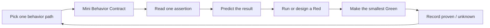
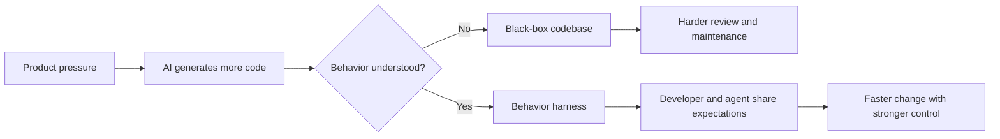
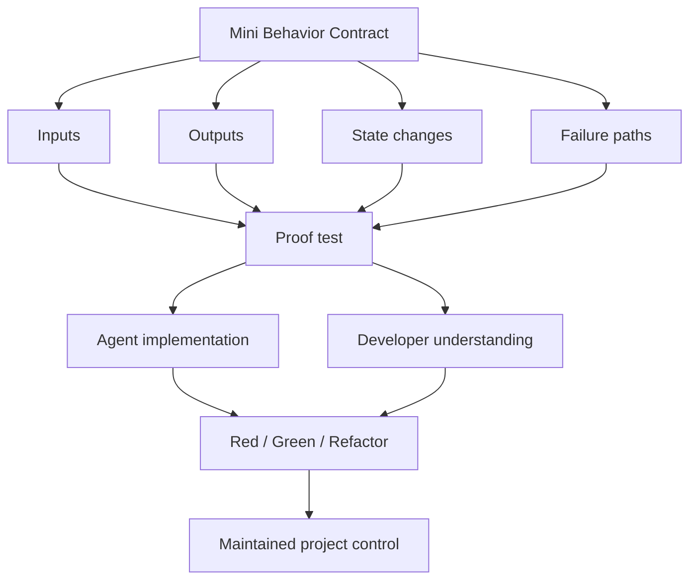

# Interactive TDD Pedagogy


An agent skill for AI pair programming, project takeover, code-reading practice,
and contract-gated TDD learning.

It helps you take over an unfamiliar codebase, even when the language or
framework is also unfamiliar, by turning "AI explains the project" into a small
loop of behavior contracts, assertions, predictions, red-green checks, and
recorded learning.

[中文说明](./docs/zh-CN.md)

## Quickstart

Install from GitHub with the skills installer:

```bash
npx skills@latest add laid-backprogrammer/interactive-tdd-pedagogy-skills
```

Then invoke the skill in your agent:

```text
$interactive-tdd-pedagogy
```

You can also skip the interactive agent picker and target agents directly:

```bash
npx skills@latest add laid-backprogrammer/interactive-tdd-pedagogy-skills --agent codex --skill interactive-tdd-pedagogy -y
npx skills@latest add laid-backprogrammer/interactive-tdd-pedagogy-skills --agent claude-code --skill interactive-tdd-pedagogy -y
npx skills@latest add laid-backprogrammer/interactive-tdd-pedagogy-skills --agent trae --skill interactive-tdd-pedagogy -y
npx skills@latest add laid-backprogrammer/interactive-tdd-pedagogy-skills --agent trae-cn --skill interactive-tdd-pedagogy -y
```

## What It Does

This skill turns project onboarding into a guided AI pair-programming session.

Instead of asking the agent to explain everything, it makes the agent:

- choose one narrow behavior path;
- write a tiny behavior contract;
- trace one test assertion back to the code;
- ask you one small prediction question;
- use red-green-refactor only after the expected behavior is clear;
- record what is proven, unknown, and worth reviewing later.

The goal is not to let AI replace your understanding. The goal is to use AI to
increase your code-reading ability and project control.

## How It Works



The core unit is a Mini Behavior Contract:

```text
When <input or trigger>
the system should <observable output>
and should change <state>
because <business rule>
```

The agent is not allowed to jump straight into a large explanation or a large
fix. It must keep the loop small enough that you can actually follow the
behavior.

## When To Use It

Use this skill when you want to:

- take over a new project quickly;
- understand unfamiliar code with tests as the map;
- learn a new language through real project behavior;
- review AI-generated code without treating it as a black box;
- turn a vague feature or bug into observable expectations;
- build a harness that keeps both you and the agent aligned.

## Why It Exists

Modern models can generate code faster than most teams can review it. Product
requirements keep moving, and "old-school manual coding everything line by line"
does not match the speed of AI-assisted development.

But if the agent writes more and the developer understands less, the project
becomes a black box. That is not engineering ownership.

The core view of this skill is:

> TDD is valuable because tests force us to understand behavior: inputs,
> outputs, state changes, failure paths, and preserved expectations. Only when
> we understand behavior can we write and maintain code responsibly.

A harness is not only for the agent. It aligns the agent with expected behavior,
and it aligns the developer with the same expectation. That shared executable
understanding is what lets AI-assisted development increase control instead of
weakening it.

## Visual Model





## Local Linking

The `npx skills@latest add ...` installer is the recommended path for normal
use. If you need deterministic local linking, use:

```bash
npm run link:claude
npm run link:codex
```

The local linking script supports:

- `AGENT=claude` -> `~/.claude/skills`
- `AGENT=codex` -> `${CODEX_HOME:-~/.codex}/skills`
- `AGENT=agents` -> `~/.agents/skills`
- `AGENT=custom SKILLS_DIR=/path/to/skills` -> custom skills directory

## Included Skill

- [`interactive-tdd-pedagogy`](./skills/engineering/interactive-tdd-pedagogy/SKILL.md)
  - project takeover and code-reading training through Mini Behavior Contracts,
    Socratic checkpoints, and gated red-green-refactor loops.

## Development

List packaged skills:

```bash
npm run list:skills
```

Preview the package contents:

```bash
npm pack --dry-run
```

## Acknowledgements

The repository layout, installer-facing structure, and local linking script were
informed by [mattpocock/skills](https://github.com/mattpocock/skills). Thanks to
that project for providing a clear, practical reference for publishing agent
skills as a GitHub-installable package.
