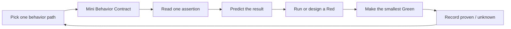
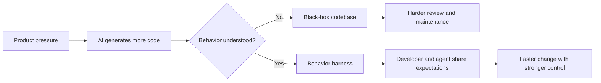
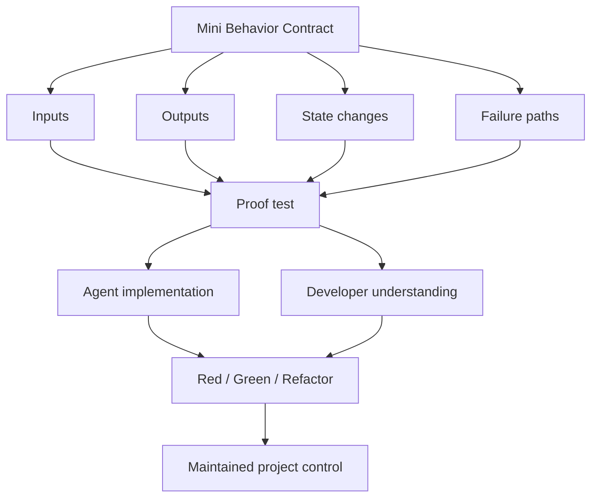

# Interactive TDD Pedagogy


In the era of hyper-capable LLMs, AI can generate thousands of lines of code in seconds. But as AI writes more, do you understand less?

**Interactive TDD Pedagogy** is a contract-gated, AI-copilot pairing system designed to reclaim developer control. Instead of letting AI turn your codebase into an unmaintainable black box, it transforms the AI into a patient codebase coach. Through structured mini-behavior contracts, assertion tracking, and Socratic gated red-green loops, it accelerates your project onboarding, enhances your code-reading mastery, and aligns executable expectations between you and the agent—even when tackling a completely unfamiliar language or framework.

[中文说明](./docs/zh-CN.md)

---

## Quickstart

Install from GitHub with the skills installer:

```bash
npx skills@latest add laid-backprogrammer/interactive-tdd-pedagogy-skills
```

Then invoke the skill in your agent:

```text
$interactive-tdd-pedagogy
```

You can also skip the interactive agent picker and target agents directly:

```bash
npx skills@latest add laid-backprogrammer/interactive-tdd-pedagogy-skills --agent codex --skill interactive-tdd-pedagogy -y
npx skills@latest add laid-backprogrammer/interactive-tdd-pedagogy-skills --agent claude-code --skill interactive-tdd-pedagogy -y
npx skills@latest add laid-backprogrammer/interactive-tdd-pedagogy-skills --agent trae --skill interactive-tdd-pedagogy -y
npx skills@latest add laid-backprogrammer/interactive-tdd-pedagogy-skills --agent trae-cn --skill interactive-tdd-pedagogy -y
```

---

## The Paradigm Shift: Code Generation vs. Code Control

### 1. The Paradox of the AI Era
We are witnessing an unprecedented leap in AI code-generation capabilities. Pressed by relentless product cycles and non-stop feature demands, "ancient manual coding"—writing every line from scratch—is no longer viable. We must develop with AI.

However, **as AI writes code faster, our control over the codebase is being diluted.**
If you let the agent write the code and you simply accept the outputs, the codebase rapidly becomes a dark, impenetrable black box. Your code-reading skills atrophy, and you become completely dependent on the AI. But remember: **LLMs, at their core, are probabilistic models. The only one truly responsible for the engineering project is you.**

### 2. The True Essence of TDD
TDD (Test-Driven Development) is not about dogmatic rituals or high coverage percentages. **The true essence of TDD is using tests to force a rigorous, structured understanding of code behavior during development.**
Only when you genuinely understand the precise inputs, expected outputs, state mutations, failure paths, and core business rules can you write, review, and maintain software responsibly.

### 3. The Dual-Aligned Harness
A test harness serves a dual purpose:
* **For the Agent**: It forces the AI agent to align its implementation with expected behavior, shielding against hallucinations.
* **For You**: It forces *us* (the developers) to align our mental model of the code behavior with the executable harness.

This shared, executable understanding is the only way to sustain long-term project control. Instead of letting AI hide the code behind a black-box curtain, this skill builds a transparent glass box.

### 4. Zero to Mastery (Even with Unfamiliar Languages)
How do you quickly take over a new codebase, especially when you are unfamiliar with the language, framework, or style?
Instead of asking the AI to "explain the project" (which only generates more overwhelming walls of text), this skill guides you through **Mini-Behavior Contracts** and **Socratic checkpoints**. It breaks down the unfamiliar codebase into a tiny, digestible loop. Step by step, it raises your reading ability, sharpens your intuition, and returns codebase ownership back to you.

---

## What It Does

This skill turns project onboarding into a guided AI pair-programming session. Instead of asking the agent to explain everything, it makes the agent:

- **Choose one narrow behavior path** at a time;
- **Write a tiny behavior contract** to align expectations;
- **Trace one test assertion** back to the implementation code;
- **Ask you one small prediction question** to test your understanding;
- **Use Red-Green-Refactor** only after the expected behavior is clear;
- **Record what is proven**, what remains unknown, and what is worth reviewing later.

The goal is not to let AI replace your understanding. The goal is to use AI to **increase your code-reading ability and project control**.

---

## How It Works



The core unit is a **Mini Behavior Contract**:

```text
When <input or trigger>
the system should <observable output>
and should change <state>
because <business rule>
```

The agent is not allowed to jump straight into a large explanation or a large fix. It must keep the loop small enough that you can actually follow and master the behavior.

---

## Visual Model





---

## When To Use It

Use this skill when you want to:

- **Take over a new project quickly** and reliably;
- **Understand unfamiliar code** using tests as the executable roadmap;
- **Learn a new language or framework** through real, live project behavior;
- **Review AI-generated code** without treating it as an opaque black box;
- **Turn a vague feature or bug** into observable, verifiable expectations;
- **Build a harness** that keeps both you and the agent aligned.

---

## Local Linking

The `npx skills@latest add ...` installer is the recommended path for normal use. If you need deterministic local linking for development, use:

```bash
npm run link:claude
npm run link:codex
```

The local linking script supports:

- `AGENT=claude` -> `~/.claude/skills`
- `AGENT=codex` -> `${CODEX_HOME:-~/.codex}/skills`
- `AGENT=agents` -> `~/.agents/skills`
- `AGENT=custom SKILLS_DIR=/path/to/skills` -> custom skills directory

---

## Included Skill

- [`interactive-tdd-pedagogy`](./skills/engineering/interactive-tdd-pedagogy/SKILL.md)
  - Project takeover and code-reading training through Mini Behavior Contracts, Socratic checkpoints, and gated red-green-refactor loops.

---

## Development

List packaged skills:

```bash
npm run list:skills
```

Preview the package contents:

```bash
npm pack --dry-run
```

---

## Acknowledgements

The repository layout, installer-facing structure, and local linking script were informed by [mattpocock/skills](https://github.com/mattpocock/skills). Thanks to that project for providing a clear, practical reference for publishing agent skills as a GitHub-installable package.
