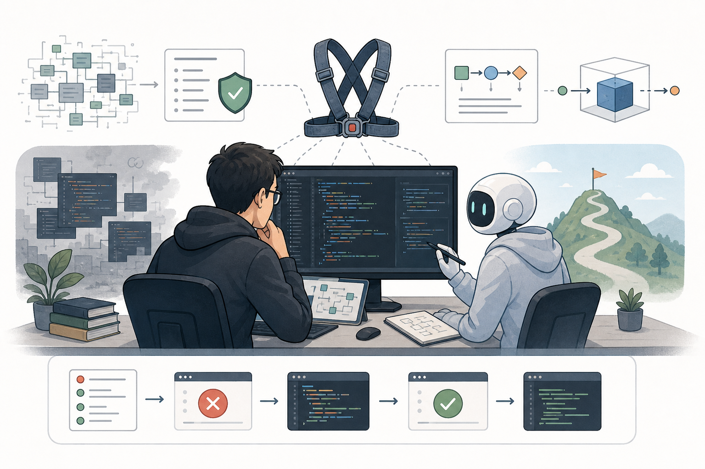
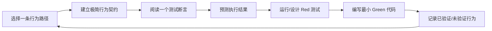
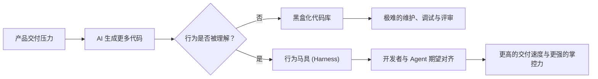
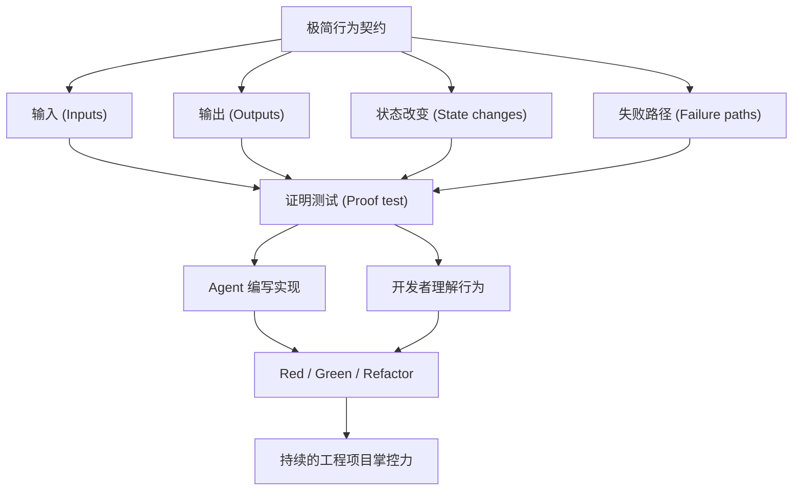

# Interactive TDD Pedagogy 中文说明



在大模型能力日新月异的时代，AI 可以在几秒钟内生成成百上千行代码。但是，当 AI 写得越来越多时，你对代码的掌控力是在增强，还是在被悄然削弱？

**Interactive TDD Pedagogy** 是一个基于 Agent IDE 的项目接手与代码阅读训练系统。它的核心使命是：**在 AI 辅助开发的巨浪中，帮助人类开发者重新夺回对代码的绝对掌控权。**

它把“AI 机械地解释项目”重塑为由“行为契约（Behavior Contract）- 期望对齐 - 苏格拉底式追问 - 红绿重构门控”组成的极小闭环。它不只是一个结对编程助手，更是你的项目接手教练——即使面对完全陌生的项目、不熟悉的语言甚至是未曾接触过的语法，它也能手把手带你建立清晰的行为期望，快速提升代码阅读和项目掌控力。

---

## 快速开始

使用 skills 安装器从 GitHub 直接安装：

```bash
npx skills@latest add laid-backprogrammer/interactive-tdd-pedagogy-skills
```

然后在你的 Agent 中调用该 skill：

```text
$interactive-tdd-pedagogy
```

你也可以跳过交互式 Agent 选择器，直接指定目标 Agent 进行安装：

```bash
npx skills@latest add laid-backprogrammer/interactive-tdd-pedagogy-skills --agent codex --skill interactive-tdd-pedagogy -y
npx skills@latest add laid-backprogrammer/interactive-tdd-pedagogy-skills --agent claude-code --skill interactive-tdd-pedagogy -y
npx skills@latest add laid-backprogrammer/interactive-tdd-pedagogy-skills --agent trae --skill interactive-tdd-pedagogy -y
npx skills@latest add laid-backprogrammer/interactive-tdd-pedagogy-skills --agent trae-cn --skill interactive-tdd-pedagogy -y
```

---

## 核心观点与设计哲学：AI 代码生成时代的掌控力重建

### 1. 自动化的悖论：AI 在狂飙，我们在退化？
大模型的代码生成能力正在以惊人的速度提升。在持续的业务压力与不断堆叠的产品需求面前，坚持过去的“古法编程”——每一行都由人类慢慢手写——显然已经无法匹配现代的开发节奏。我们必须、也正在与 AI 结对编程。

然而，**AI 写代码的能力越强，我们对代码的掌控力却在被无形地削弱。**
如果只让 AI 不断堆砌代码，而开发者仅仅扮演“一键采纳”的审查员，整个代码库就会迅速变成一个不可触碰的黑盒。长此以往，开发者的代码阅读与系统把控能力会逐渐退化，直至完全依赖 AI。
但不可忽略的底层事实是：**LLM 再强，本质上仍然是概率模型。真正对项目质量和线上稳定负责的，永远只有我们自己。**

### 2. TDD 的真实精髓：对行为的极致理解
TDD（测试驱动开发）的精髓从来不在于教条式的测试覆盖率，也不是形式上的先写测试。**TDD 的真正价值，在于通过测试强迫我们在开发时梳理和增加对代码行为的绝对理解。**
只有当你真正想清楚了输入是什么、可观察的输出应该是什么、状态如何流转、失败路径如何处理，你才算真正理解了这段代码。只有真的理解了行为，才能真正写好代码，也才能在 AI 生成代码时，有能力戳破幻觉，守护工程防线。

### 3. 双向对齐的 Harness（行为安全网）
Harness（测试马具/安全网）在 AI 结对时代承载着双向对齐的特殊使命：
* **对齐 Agent**：让 Agent 的代码生成逻辑必须与可执行的行为契约对齐，消除模型随机性与幻觉。
* **对齐 开发者**：迫使人类开发者对代码行为的期望，也和这套 harness 对齐。

只有这样，测试马具才不再是单纯的“跑通测试”，而是人、Agent 与代码之间**可执行的共同理解契约**。这是长期维护中能够维持掌控力、防止项目黑盒化的唯一出路。

### 4. 跨越语言与业务壁垒：从零到掌控
如何快速接手一个全新的、甚至语言语法都不熟悉的项目？
如果你让 AI “给我解释一下这个项目”，你只会得到一大堆缺乏上下文的文字垃圾。
而本 skill 将“接手项目”拆解为**极小的行为契约循环**。每次只选一条极窄的路径，从一个断言反向追溯到业务逻辑，通过小而精的苏格拉底追问和红绿变化，带你走过最艰难的认知门槛。这不仅能让你在几分钟内建立起对项目的直观认知，更能在此过程中跨越语法障碍，快速训练出强大的代码阅读能力与技术把控力。

---

## 它能做什么

该 skill 将项目接手转变为由 AI 引导的深度结对编程会话。Agent 不会直接抛出大段解释，而是强迫自身：

- 每次只**选择一条极窄的行为路径**；
- 编写一个**极小的行为契约**以对齐期望；
- 将**一个测试断言**反向追踪至具体实现代码；
- 提出**一个具体的预测问题**来检验你的理解；
- 只有在行为期望完全明确后，才启动 **Red-Green-Refactor**；
- **记录已证明的行为**、未知的盲点以及后续需要复习的任务。

我们的目标不是让 AI 替代你的大脑，而是利用 AI **百倍地放大你的代码阅读能力和对项目的掌控力**。

---

## 运作机制



核心单元是 **极简行为契约 (Mini Behavior Contract)**：

```text
当 <输入或触发条件>
系统应该 <可观察输出>
并且应该改变 <状态>
因为 <业务规则>
```

Agent 不被允许直接进行大面积的代码修改或宏观解释。它必须将每一步控制在你能完全跟上并掌握的认知负荷之内。

---

## 可视化模型





---

## 适合什么时候使用

当你希望实现以下目标时：

- **快速、可靠地接手一个新项目**；
- **通过测试作为路线图**，透彻理解陌生的代码；
- 通过真实的业务行为，**快速学习一门新语言或新框架**；
- **评审 AI 生成的代码**，而不是盲信和一键采纳；
- 将模糊的需求或 bug 转化为**可观察、可验证的具体行为**；
- **构建一套 harness**，让人类与 Agent 围绕同一套期望高效协作。

---

## 本地链接

对于普通用户，推荐使用 `npx skills@latest add ...`。如果你在本地进行开发并需要确定性的本地链接，请使用：

```bash
npm run link:claude
npm run link:codex
```

本地链接脚本支持：

- `AGENT=claude` -> `~/.claude/skills`
- `AGENT=codex` -> `${CODEX_HOME:-~/.codex}/skills`
- `AGENT=agents` -> `~/.agents/skills`
- `AGENT=custom SKILLS_DIR=/path/to/skills` -> 自定义 skills 目录

---

## 内置 Skill

- [`interactive-tdd-pedagogy`](../skills/engineering/interactive-tdd-pedagogy/SKILL.md)
  - 通过极简行为契约、苏格拉底检查点和红绿重构门控闭环，提供项目接手与代码阅读训练。

---

## 致谢

本仓库的目录组织、面向 `skills` 安装器的结构，以及本地链接脚本，参考了 [mattpocock/skills](https://github.com/mattpocock/skills)。感谢该项目提供了一个清晰、实用的 agent skills 发布范例。
